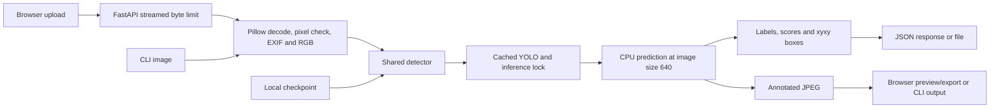

# SkyGuard Vision

[](https://github.com/dilarakoru/skyguard-vision/actions/workflows/ci.yml)

A fire/smoke detection project built with **Ultralytics YOLO, PyTorch, FastAPI and Pillow**. The public application provides a reproducible CPU inference workflow, while the broader project history includes CUDA-enabled GPU training, model experimentation and Raspberry Pi edge testing.


**Contents:** [Data/model](#data-and-model-provenance) · [Architecture](#architecture) · [Method](#inference-method) · [Results](#verified-results) · [Setup](#installation-and-model-setup) · [API](#api) · [Training](#training) · [Tests](#tests)

## Problem and scope

The project turns existing detection scripts and a research checkpoint into one inspectable application. Browser and CLI share preprocessing and inference, so input handling and thresholds remain consistent. Missing models are distinguished from successful inference with no detections.

The supported public workflow is **single-image inspection on CPU**. Historical project work also included GPU training and Raspberry Pi edge-inference tests, but live monitoring, geolocation, emergency alerting and field reliability are not demonstrated by the current repository.

## Data and model provenance

### Served checkpoint

| Property | Recorded value |
|---|---|
| Original local artifact | `yolov11n_best.pt` |
| Application location | `models/fire-smoke.pt` or `SKYGUARD_MODEL` |
| Observed classes | `fire`, `smoke` |
| File size | 5,447,507 bytes |
| Validated runtime | Ultralytics 8.3.15; CPU |
| SHA-256 | `4071eda4c380e04be1e2000fded0ca96d7d8371587c7680ce4bd177ea4b9f904` |

The checkpoint is an existing research artifact. A complete training manifest, split history and benchmark evaluation have not been conclusively linked to it. Its local filename alone does not verify all training details. See [MODEL_CARD.md](docs/MODEL_CARD.md).

**Weights and sample images are not tracked.** The prepared desktop copy includes a local model/sample; a fresh GitHub clone requires an authorized compatible checkpoint and your own image. The application never silently downloads or substitutes an unrelated detector.

### Historical dataset in the research folder

A separate local Roboflow export is labeled **J.A.M. Busqueda – Prototype 1**. Its bundled metadata records an export on June 15, 2025, a CC BY 4.0 license, 13,941 images, auto-orientation, stretching to 640×640, and augmentation using 90-degree rotations. These are statements from the local export metadata, not an independently audited upstream manifest.

Its YAML names **fire, human, object and vehicle**. That is different from the served **fire/smoke** checkpoint. It is therefore documented as historical research data, **not asserted to be the served checkpoint's training dataset**.

Read-only inventory of the local export:

| Split | Image files (JPEG/PNG/WebP) | Label text files |
|---|---:|---:|
| Train | 10,790 | 12,835 |
| Validation | 1,331 | 1,331 |
| Test | 670 | 670 |

Cache arrays were excluded. Current image totals differ from export metadata; training image/label counts also differ. These must be reconciled before claiming a reproducible training run. No historical images or labels are republished here.

### Data expected for a new training run

Use an authorized YOLO detection dataset with matched image/label stems. Label rows have the format:

```text
class_id center_x center_y width height
```

Coordinates are normalized to image dimensions. Example YAML, to be created with your real paths and matching class IDs:

```yaml
path: /absolute/path/to/dataset
train: images/train
val: images/val
test: images/test
names:
  0: fire
  1: smoke
```

Keep related video frames and augmented versions of one source in the same split. Document image attribution, include hard negatives and check duplicate leakage before evaluation.

## Architecture



FastAPI runs inference in a worker thread. A lock serializes shared model access, and caching avoids reloading the checkpoint per request. This favors simple predictable local use over throughput. No load-testing claim is made.

## Inference method

1. Accept JPEG, PNG or WebP bytes; reject empty/unreadable inputs.
2. Enforce a **12 MiB** byte limit and **20-million-pixel** image limit.
3. Apply EXIF orientation and convert to RGB.
4. Load the configured checkpoint and confirm it contains `fire` and `smoke` classes.
5. Run Ultralytics prediction with `device='cpu'`, `imgsz=640`, and confidence **0.35** by default; allowed range **0.05–0.95**.
6. Return labels, scores and `[x1, y1, x2, y2]` boxes in pixel coordinates.
7. Convert the plotted BGR annotation to RGB and encode a quality-90 JPEG.

Detection architecture and postprocessing are delegated to Ultralytics; there is no custom detection head or custom nonmaximum suppression. The threshold is a filtering control, not a calibrated probability guarantee. Lowering it can expose weaker detections and more false positives.

## Verified results

One existing local image was successfully processed through CPU inference and the browser flow. At threshold **0.35**:

| Box | Label | Confidence | xyxy coordinates (pixels) |
|---|---|---:|---|
| 1 | fire | 0.8206 | 91.71, 15.25, 159.94, 109.28 |
| 2 | fire | 0.7017 | 194.80, 43.15, 266.24, 123.90 |
| 3 | fire | 0.6728 | 201.37, 41.89, 266.36, 104.33 |

See [the recorded JSON](docs/inference-example.json). A prior threshold-0.25 check also returned a low-confidence smoke box. Some boxes overlap; three boxes must not be interpreted as three distinct fires.

**This is one-image functionality evidence, not a benchmark.** No validated mAP, precision/recall, FPS or field-reliability result is claimed. Those require ground truth, a documented held-out dataset and hardware/latency reporting.

## Installation and model setup

Requirements: **Python 3.10**, Git, an authorized compatible checkpoint and an image. CPU is sufficient. Full runtime installation includes PyTorch; the smaller test dependency set does not provide inference.

```bash
git clone https://github.com/dilarakoru/skyguard-vision.git
cd skyguard-vision
python -m venv .venv
```

PowerShell activation:

```powershell
.\.venv\Scripts\Activate.ps1
```

macOS/Linux activation:

```bash
source .venv/bin/activate
```

Install:

```bash
python -m pip install -r requirements.txt
```

Create `models/` and place the checkpoint at `models/fire-smoke.pt`, or set an absolute path:

```powershell
$env:SKYGUARD_MODEL='C:\path\to\fire-smoke.pt'
```

POSIX equivalent: `export SKYGUARD_MODEL=/absolute/path/to/fire-smoke.pt`.

```bash
python -m uvicorn app:app --host 127.0.0.1 --port 8002
```

Open **http://127.0.0.1:8002**; API docs: **http://127.0.0.1:8002/docs**. Upload, choose a threshold, analyze and download. `/health` checks file presence; the first inference actually loads and validates the checkpoint.

### CLI

```bash
python predict.py path/to/image.jpg --model path/to/fire-smoke.pt --confidence 0.35 --output runs/result.jpg
```

Outputs are `runs/result.jpg` and `runs/result.json`. `--model` overrides the environment/default. Runtime caches are in ignored `.runtime/` directories. Restart after replacing a checkpoint at a cached path.

## API

| Endpoint | Contract |
|---|---|
| `GET /health` | Availability, checkpoint-file presence and CPU device |
| `POST /api/detect?confidence=0.35` | Raw image bytes; returns JSON with detections and base64 JPEG |
| `GET /` | Browser UI |

PowerShell example (`curl.exe` avoids the curl alias):

```powershell
curl.exe -X POST "http://127.0.0.1:8002/api/detect?confidence=0.35" -H "Content-Type: image/jpeg" --data-binary "@path/to/image.jpg" --output result.json
```

Send **raw bytes, not multipart form data**. Response fields are `detections`, `count`, `processed_at`, `image` and `threshold`. Each detection has `label`, `confidence` and `xyxy`. `processed_at` is UTC processing time, not capture time or geographic location.

| Status | Meaning |
|---|---|
| 200, empty detections | Inference ran but no box survived the threshold |
| 400 | Invalid image, pixel limit or incompatible classes |
| 413 | Byte limit exceeded |
| 422 | Invalid threshold parameter |
| 503 | Checkpoint file missing |

Unexpected runtime failures are not represented as successful empty results.

## Hardware and development history

The current application defaults to CPU inference for straightforward local reproduction, but the model-development work was not CPU-only.

Historical notebooks and training artifacts record:

- CUDA-enabled training on **NVIDIA A100-SXM4-40GB** and **Tesla T4** GPUs.
- Experiments across **YOLO11n, YOLO11m, YOLO11l and YOLOv12L** configurations.
- 640×640 training runs with mixed-precision (`amp`) enabled.
- Transfer/retraining experiments and saved training artifacts such as result CSVs, confusion matrices, PR/F1 curves and model weights.
- Dataset-quality checks for missing labels, corrupted images and image/annotation consistency.
- Raspberry Pi-based edge-inference testing during the original project work.

These historical experiments are separate from the checkpoint served by the current application. See [Training history](docs/TRAINING_HISTORY.md) for the documented experiment context.

## Training

Training is explicit and separate from application startup:

```bash
python train.py --data path/to/data.yaml --weights path/to/start.pt --epochs 30 --batch 4 --device cpu
```

Both files must exist locally. Image size is 640; outputs go under `runs/`. Supplied weights are not overwritten. Use `--device 0` on a configured CUDA machine. A new model release should preserve dataset/split manifests, arguments, versions and an independent evaluation.

## Tests

Lightweight API tests do not require checkpoint downloads:

```bash
python -m pip install -r requirements-test.txt
python -m unittest discover -s tests -v
```

Four tests cover invalid inputs, response structure, confidence validation and missing-model behavior. Controlled test doubles isolate the API contract; CI is not model-quality evaluation. Separate real-model evidence appears in Results.

| Problem | Check |
|---|---|
| 503 / model missing | Set `SKYGUARD_MODEL` or add local authorized weights |
| Wrong classes | Use a compatible checkpoint containing both fire and smoke |
| Invalid image / 413 | Check format, file size and pixel dimensions |
| Empty detection list | Review input and threshold; absence of detections is not proof of safety |

## Repository structure

```text
app.py                  FastAPI and streamed upload validation
detector.py             Shared preprocessing and CPU inference
predict.py              CLI and JPEG/JSON outputs
train.py                Separate training command
templates/index.html    Browser UI
docs/                   Model card, inference evidence and training history
models/                 Local ignored weights
runs/                   Ignored generated outputs
tests/                  API tests
.github/workflows/      Lightweight CI
```


