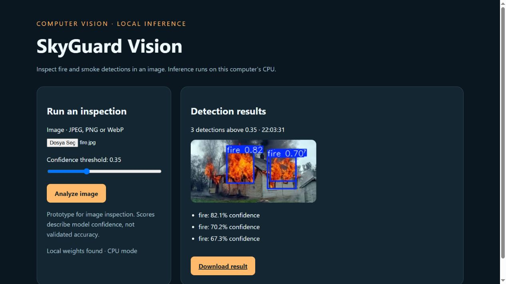

# SkyGuard Vision

> Product walkthrough, design trade-offs and next experiments: [Engineering notes](docs/ENGINEERING.md).



A CPU-first fire and smoke image-inspection demo with a browser interface, confidence threshold, annotated-image export and a reusable inference API.

This portfolio version turns existing YOLO research weights and separate interface scripts into one small, testable application. It does not claim a validated emergency detection service or geolocation system.

## Quick start

Tested with Python 3.10:

```powershell
python -m venv .venv
.\.venv\Scripts\Activate.ps1
python -m pip install -r requirements.txt
python -m uvicorn app:app --host 127.0.0.1 --port 8002
```

Open http://127.0.0.1:8002 and upload a JPEG, PNG or WebP image.

### Model setup

The local desktop package includes existing weights at `models/fire-smoke.pt`, **ignored by Git**. A source-only GitHub clone intentionally does not include them. Put an authorized, compatible Ultralytics checkpoint with `fire` and `smoke` classes at that path, or set `SKYGUARD_MODEL` to its absolute path. The app never silently downloads or substitutes an unrelated model.

See [model card](docs/MODEL_CARD.md). Dataset and weight redistribution rights were not established by the folder scan, so raw data and weights are not in the GitHub source ZIP. The source-only package needs model setup before inference; the desktop copy is ready for local inference.

## CLI

```powershell
python predict.py samples/local/fire.jpg --output runs/result.jpg --confidence 0.35
```

The desktop copy includes the existing local sample image; it is also excluded from Git. For a GitHub clone, supply your own image path. The command writes an annotated image and JSON detections.

## API

- `GET /health`: application availability and whether the configured model file exists. This does not load or validate the model.
- `POST /api/detect?confidence=0.35`: raw image bytes as the body; returns boxes, labels, confidence scores, UTC processing time and a base64 JPEG.
- `GET /`: browser UI.

The model is cached, CPU inference is serialized to protect shared model state, EXIF orientation is normalized, and oversized/invalid images receive explicit errors. The API does not invent a detection location or confuse an unavailable model with “no fire.”

## Training

```powershell
python train.py --data path/to/data.yaml --weights path/to/start.pt --epochs 30 --device cpu
```

Training is an explicit separate operation. Dataset YAML and architecture-compatible initial weights must already exist. Use `--device 0` only on a configured CUDA machine. Training writes under `runs/` and does not overwrite the supplied model.

## Validation

```powershell
python -m unittest discover -s tests -v
```

Four API/input/threshold tests passed. A separate real CPU inference test with the existing local checkpoint and sample produced **three fire boxes at threshold 0.35**. A previous threshold-0.25 check additionally returned a low-confidence smoke box. This is one-image functionality validation, **not accuracy, recall or a field-performance benchmark**. Overlapping detections remain a model behavior to evaluate.

## What changed from the research copy

- Consolidated CLI and FastAPI/browser interface around one detector module.
- Removed hard-coded local-network dependencies from the runnable app.
- Configurable model location and confidence threshold; relative output paths.
- Explicit missing-model and invalid-image handling.
- No raw dataset, personal documents or environment folders in Git.

No Raspberry Pi hardware, camera stream, deployed Flask service or retraining run was validated here. Those historical project claims are outside the scope of this desktop demo.
